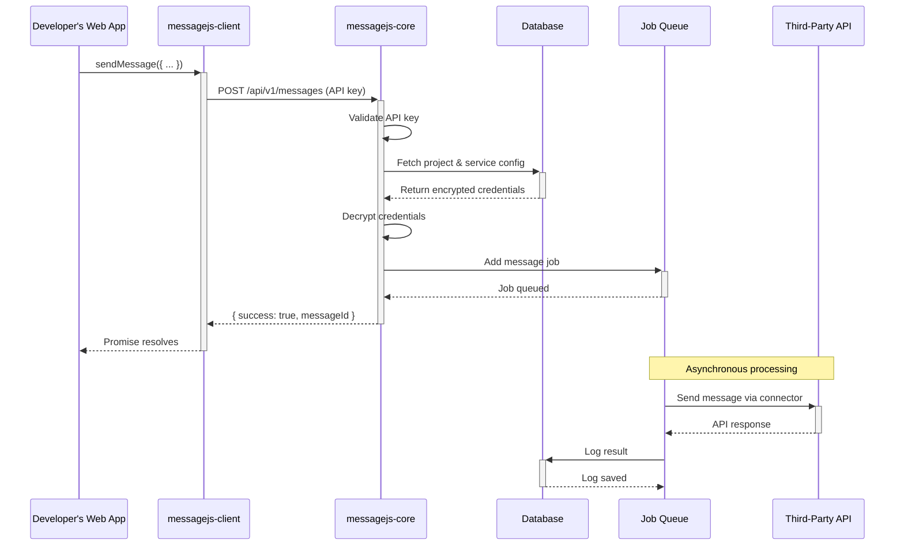
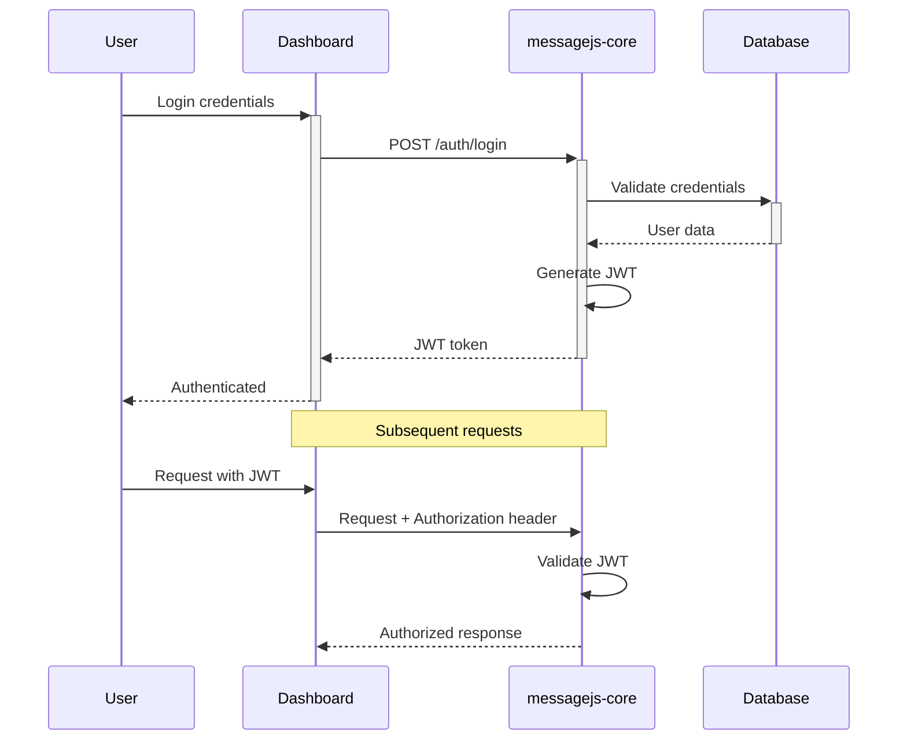
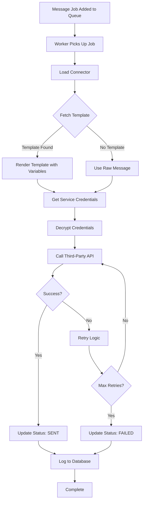
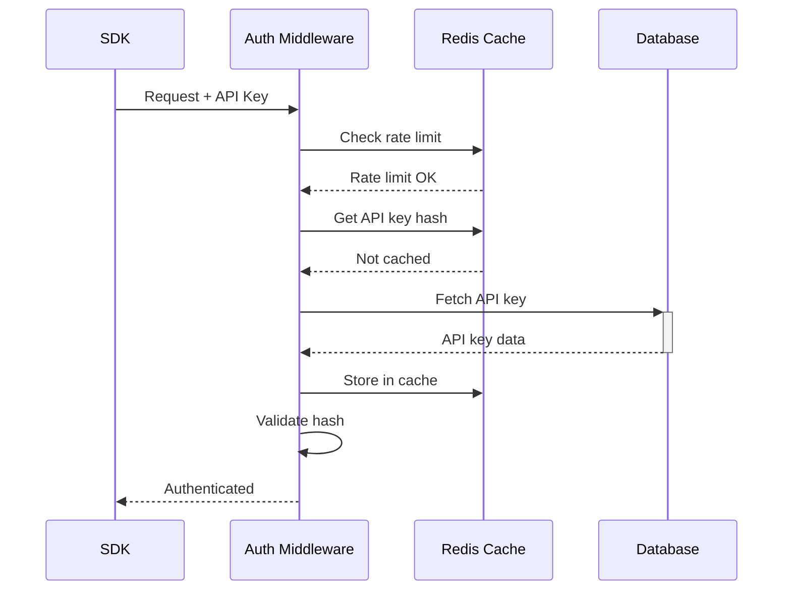
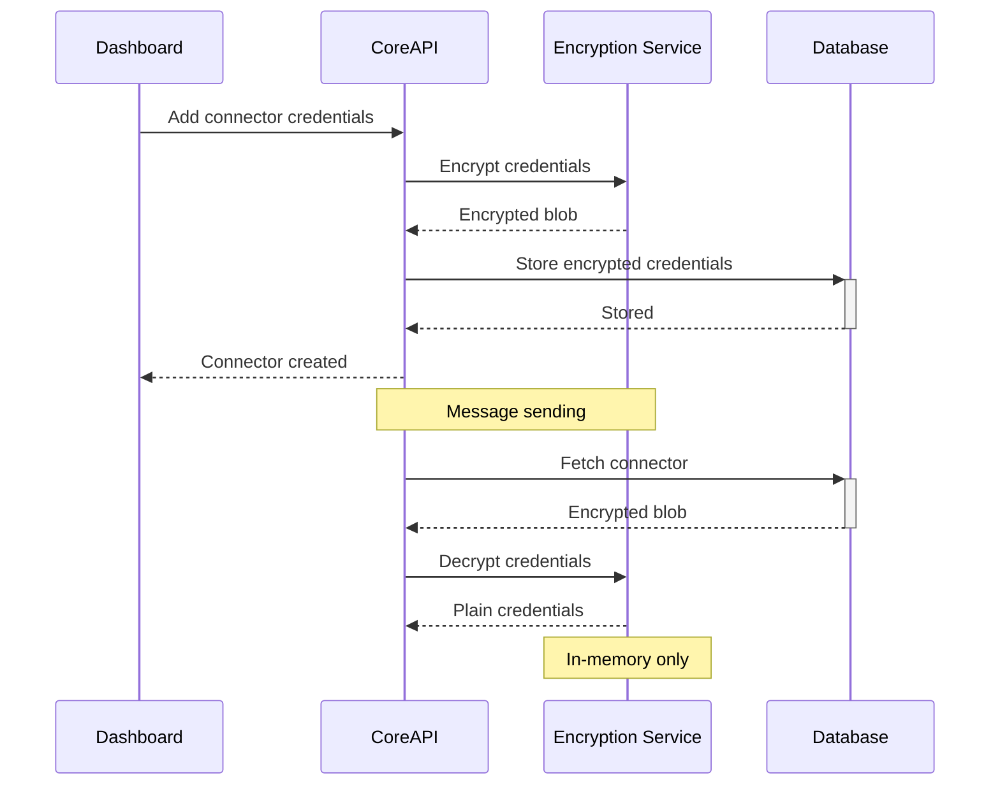
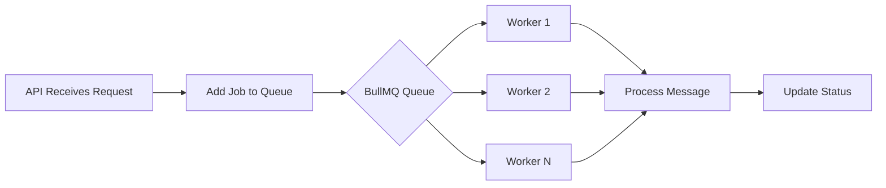

# Data Flow

Understanding how data flows through the MessageJS system.

## Message Sending Sequence

## Authentication Flow

## Connector Execution Flow

## API Key Validation Flow

## Credential Encryption Flow

## Job Queue Processing

## Next Steps

- [Technology Stack](./technology-stack)
- [Core Components](./core-components) (coming soon)
- [API Reference](./api-reference) (coming soon)

